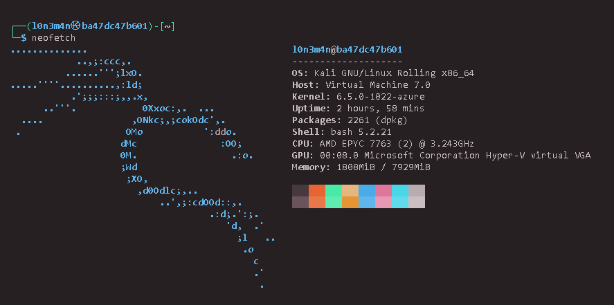
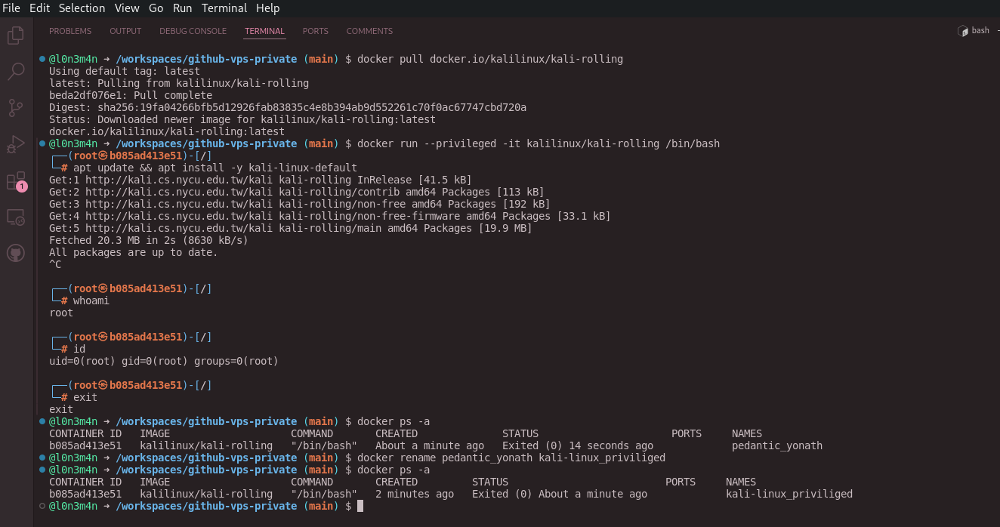
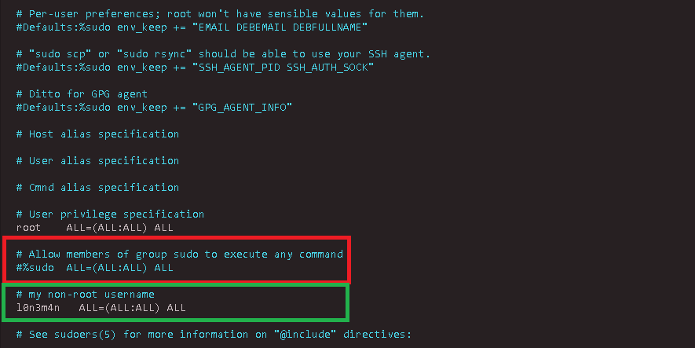
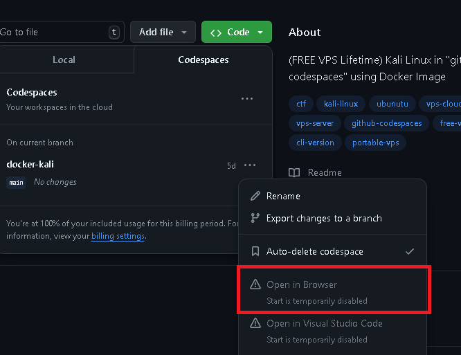

<h1 align="center">
  Github-VPS
</h1>
<p align="center">
    <a href="https://visitorbadge.io/status?path=https%3A%2F%2Fgithub.com%2Fl0n3m4n%2Fgithub-vps">
    
  </a>
    <a href="https://www.facebook.com/l0n3m4n">
        
    </a>
      <a href="https://www.twitter.com/l0n3m4n">
        
    </a>
    <a href="https://medium.com/@l0n3m4n">
        
    </a>
    <a href="https://hub.docker.com/r/kalilinux/kali-rolling">
    
    </a>
    <a href="https://www.kali.org/">
          
    </a>
</p>
<br>
<br>



## 📜 Description 
GitHub Codespaces allows developers and hackers to create and utilize their coding environments directly from GitHub in the cloud. As a CTF player or pentester, you can also leverage GitHub Codespaces similarly to a VPS (Virtual Private Server). This makes it easy to work on projects from anywhere with the flexibility of a portable development setup using Docker.

## 📚 Table of Contents
- 📜 [Description](#-description)
- 🔥 [What's Nice](#whats-nice)
- 🐳 [Installation](#-installation)
- 🙍🏻‍♂️ [Configuration](#-configuration)
- 🚫 [Temporarily Disabled](#-temporarily-disabled)
- 👨🏾‍⚖️ [License](#-license)

 
## 🔥 What's Nice
- Offers more power with `2-vCPUs`, `8GB-RAM`, and a temporary `32GB-SSD` storage drive.
- Higher performance with `4-vCPUs`, `16GB-RAM`, and a temporary `32GB-SSD` storage drive.


### 🐳 Installation

> [!NOTE] 
> [Github codespace terminal](https://docs.github.com/en/codespaces/developing-in-a-codespace/using-github-codespaces-with-github-cli)
---

```bash
# pulling images 
$ docker pull docker.io/kalilinux/kali-rolling

# Option 1: Priviliged mode (recommended for ctf players)
$ docker run --privileged -it kalilinux/kali-rolling /bin/bash

# Option 2: Interactive mode
$ docker run --tty --interactive kalilinux/kali-rolling
 
$ apt update && apt install -y kali-linux-default

$ apt update && apt install -y install kali-linux-headless
```
### Installation without errors
> [!TIP]
> Refer to default [installation Guide](./assets/installation_guide/readme.md)  


## Configuration
### Starting Docker Kali Image
```bash
# Display
$ docker ps -a

# Rename 
$ docker rename <current_name> <new_name>

# Status details 
$ docker inspect <container id>

# Start 
$ docker start <container id> (e.q) d36922fa21e8

# Attach 
$ docker attach <container id>

# Stop  
$ docker stop <container id>

# Remove
$ docker rm <container id>
```

### Adding non-root user 

```bash
$ sudo apt update && sudo apt upgrade -y

# option 1:
# To add a new user:
$ sudo adduser l0n3m4n

# option 2:
# Set a Default Shell
$ sudo useradd -m -s /bin/bash l0n3m4n

# Add User to Groups
$ sudo usermod -aG sudo username

# Set a Password for the User
$ sudo passwd username

# Verify User Creation
grep username /etc/passwd

# Add user to sudoers
# option 1: replace to your username
username ALL=(ALL:ALL) ALL

# option 2: 
$  echo "username ALL=(ALL) NOPASSWD:ALL" > /etc/sudoers/username

# switching to non-root user
$ su - username

# verify
$ whoami
```

### Diskspace Monitoring 
```bash
# view ram details
$ free -h 

# view disk space 'du'
$ du -h --max-depth=1 /

# view disk space GB
$ df -h

```

### Docker Privileged
> [!IMPORTANT]
> The way to use openvpn or enable `tun0` you need to add `--privileged` option instead using `--tty` by default, Docker containers do not have access to TUN/TAP devices on the host system due to security and isolation concerns.
```bash
# options 1:
$ docker run --privileged -it kalilinux/kali-rolling /bin/bash

# Option 2: Use --device Flag (More Secure)
# A more secure approach is to use the --device flag to explicitly map the TUN/TAP device from the host into the container. This approach is more controlled and limits access to only the necessary device.

$ docker run --device=/dev/net/tun:/dev/net/tun -it kalilinux/kali-rolling /bin/bash

# Verify TUN/TAP Functionality Inside the Container
$ ls -l /dev/net/tun
```
### Automation in new terminal session 
> kali_privs.sh
```sh
#!/bin/bash

RED='\033[0;31m'
GREEN='\033[0;32m'
YELLOW='\033[0;33m'
NC='\033[0m'

# Checking Kali-linux docker ID
kali_id=$(docker ps -a -q)
bash='/bin/bash'

echo -e '${YELLOW}Starting another terminal kali privs${NC}'
docker start $kali_id
docker exec -it $kali_id $bash
echo -e "${YELLOW}Success..${NC}"
sleep 1.5
```

### New Terminal Session
> [!NOTE]
> Github codespace terminal
```bash
$ docker exec -it <container_id> /bin/bash
```

## Adding Graphical User Interface (noVNC)
> [!IMPORTANT]
> Run this script in the terminal of your Github Codespace, which is using Ubuntu OS

> setup-noVNC.sh 
```sh
#!/bin/bash

RED='\033[0;31m'
GREEN='\033[0;32m'
YELLOW='\033[0;33m'
NC='\033[0m' 

error_exit() {
    echo -e "${RED}Error: $1${NC}" >&2
    exit 1
}
set -e

echo -e "${GREEN}Starting setup of VNC and noVNC on github codespace terminal...${NC}"

# Update and install necessary packages
echo -e "${YELLOW}1. Updating system and installing required packages...${NC}"
{
    sudo apt update
    sudo apt install -y xfce4 xfce4-goodies novnc python3-websockify python3-numpy tightvncserver htop nano neofetch
} || error_exit "Failed to update and install packages."

# Generate SSL certificate
echo -e "${YELLOW}2. Generating SSL certificate for noVNC...${NC}"
{
    mkdir -p ~/.vnc
    openssl req -x509 -nodes -newkey rsa:3072 -keyout ~/.vnc/novnc.pem -out ~/.vnc/novnc.pem -days 3650 -subj "/C=US/ST=State/L=City/O=Organization/OU=OrgUnit/CN=localhost"
} || error_exit "Failed to generate SSL certificate."

# Start VNC server to create initial configuration files
echo -e "${YELLOW}3. Starting VNC server to create initial configuration files...${NC}"
{
    vncserver
} || error_exit "Failed to start VNC server."

# Kill the VNC server to edit the configuration
echo -e "${YELLOW}4. Stopping VNC server to modify configuration files...${NC}"
{
    vncserver -kill :1
} || error_exit "Failed to kill VNC server."

# Backup and create new xstartup file
echo -e "${YELLOW}5. Backing up old xstartup file and creating a new one...${NC}"
{
    mv ~/.vnc/xstartup ~/.vnc/xstartup.bak

    cat <<EOL > ~/.vnc/xstartup
#!/bin/sh
xrdb \$HOME/.Xresources
startxfce4 &
EOL

    chmod +x ~/.vnc/xstartup
} || error_exit "Failed to back up and create xstartup file."

echo -e "${GREEN}Succesfully configured please run ${YELLOW}start-novcn.sh${NC}"
```
### Starting noVNC Web access 
> start-novnc.sh
```sh
#!/bin/bash

NC="\e[0m"        
RED="\033[0;31m"      
GREEN="\033[0;32m"    
YELLOW="\033[1;33m"   
BLUE="\033[1;34m"     
CYAN="\033[1;36m"     
WHITE="\033[1;37m"    
MAGENTA="\033[1;35m"  

WEB_DIR="/usr/share/novnc/"
CERT_FILE="$HOME/.vnc/novnc.pem"
LOCAL_PORT="5901"
LISTEN_PORT="6080"


# Check if the cert file exists
if [ ! -f "$CERT_FILE" ]; then
    echo -e "${RED}Error: Certificate file not found: ${BLINK}$CERT_FILE${NC}"
    exit 1
fi

# Start noVNC
echo -e "${YELLOW} Starting noVNC to enable web-based VNC access...${NC}"
websockify -D --web="$WEB_DIR" --cert="$CERT_FILE" $LISTEN_PORT localhost:$LOCAL_PORT

# Start vncserver
# Note: adjust the resolution if applicable
echo -e "${YELLOW} Starting novncserver${NC}"
vncserver -geometry 1920x1080

echo -e "${GREEN}noVNC server started on port ${WHITE}$LISTEN_PORT${WHITE}, forwarding to localhost:${WHITE}$LOCAL_PORT${NC}"

```
## 🚫 Temporarily Disabled 
If you've used 100% of the included services for GitHub Codespaces storage, a few things might happen depending on your account settings and actions.

1. **Inability to Use Codespaces**: You won't be able to create or use GitHub Codespaces until either your `free allotment resets next month` or you take action to manage your usage.
2. **Options to Regain Access**:
    - Set Up a Spending Limit: You can set up a `spending limit` on your GitHub account to prevent unexpected charges and manage your usage effectively.
    - Delete Unused Resources: Consider `deleting Codespaces` or `prebuilds` that are no longer needed to free up space and potentially reduce future charges.
3. **Access to In-Progress Work**: It's important to `export` any unpushed work to a branch if you want to retain access to your in-progress projects. This ensures you have a backup and can continue working on them when you regain access to Codespaces.
4. **Review Usage and Charges**: GitHub provides a `usage report` where you can see detailed information about your Codespaces and prebuild usage. This can help you understand your usage patterns and manage future usage effectively.
---



## 🔄 Changelog
### v1.1.0 - [2024-06-29]
- Adjustment:
    - Adding `privileged` user mode to enable TUN error when starting the OpenVPN file.
      
## 📝 Todo
- [x] **~~Adding remotehost for graphical user inferface (GUI), this includes xrdp, ssh, noVNC and etc.~~**
- [ ] **Adding Automated builds Dockerfile to ensure consistency and reliability.**
- [ ] **Adding ngrok to exposed your cloud servers behind NATs and firewalls to the public internet over secure tunnels.**
- [ ] **Adding Openvpn default configuration to ensure privacy and security**

## 👨🏾‍⚖️ License
This project is under terms of the [MIT License](LICENSE). bugs and error, create [issue](https://github.com/l0n3m4n/github-vps/issues/new)
